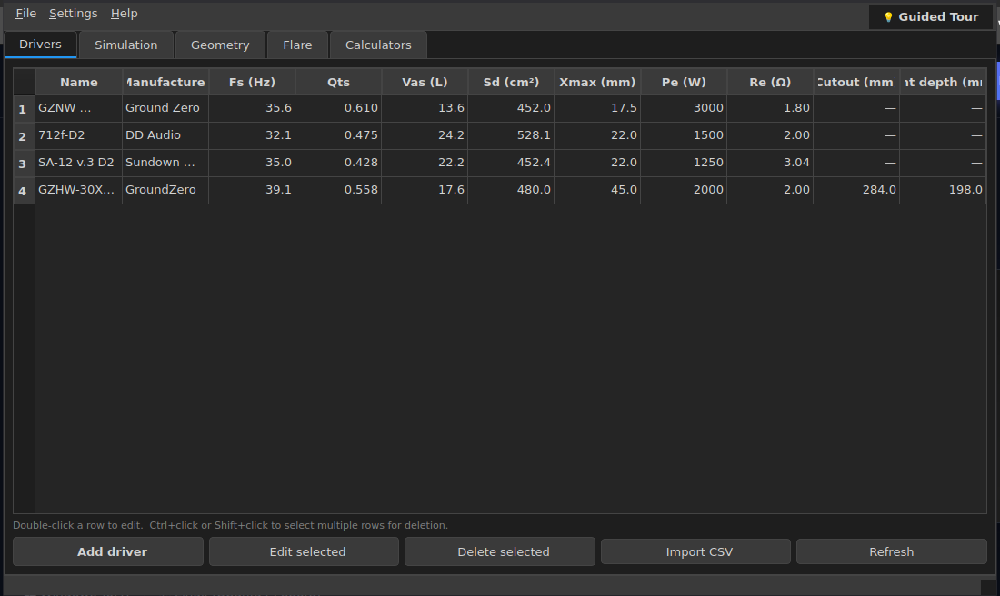

# NordSonic Speaker Tool

<p align="center">
  
</p>

<h3 align="center">NordSonic</h3>

<p align="center">
  <strong>A modern, high-precision loudspeaker enclosure design and simulation suite.</strong>
</p>

<p align="center">
  <a href="https://github.com/1n54n17y/NordSonic/actions"></a>
  
  
  
</p>

---

## 🚀 What is NordSonic?

NordSonic is a professional-grade loudspeaker design tool engineered to merge **acoustic simulation** with **structural cabinet design** into a single fluid workspace. 

If you are tired of switching between outdated websites, legacy software from the late 90s (like WinISD or Hornresp), and complex geometry sheets to design one speaker cabinet—NordSonic is built for you.

---

## ✨ Features at a Glance

*   **Acoustic Simulations:** High-accuracy physics modeling for **Sealed**, **Vented (Bass Reflex)**, **Passive Radiator**, and **4th Order Bandpass (BP4)** enclosures using verified Thiele/Small models.
*   **Structural Geometry Solver:** Input your target volume, and NordSonic immediately designs the cabinet panels, producing a complete **Cutting List** (supporting double front baffles, shelf bracings, and angled wedge cabinets).
*   **Physical Fit & Interference Checks:** Real-time warning feedback check for driver magnet collisions, basket clearance bounds, and port opening obstructions.
*   **Advanced Port Engineering:** Slot and round port designs, including 90° bent ports, chuffing velocity analysis, and Flare-it compliant margins.
*   **Integrated Toolkit:** Ohm's Law solvers, wire sizing calculators, logarithmic db/SPL estimators, and parallel/series wiring impedance animators.
*   **Built-in Tone Generator:** Sweep test frequencies right from the application to check for cabinet panel rattles or port chuffing.

---

## 📦 Tiered Editions

| Edition | Price | Key Capabilities |
| :--- | :--- | :--- |
| **Basic** | **Free** | Sealed/Vented simulation, SPL & cone excursion charts, driver database, wiring & Ohm's calculators. |
| **Home** *(Coming Soon)* | **$10/mo** or **$90/yr** | Panel cutting lists, Passive Radiator support, Baffle Step Correction, Room Gain modeling. |
| **Pro** *(Coming Soon)* | **$49/mo** or **$299/life** | Wedge enclosures, BP4 bandpass support, 90° bent ports, and Branded PDF Exports. |

---

## 🖥️ Graphical Interface Preview

The native application features a fully responsive, DPI-aware interface with a built-in light/dark theme toggle:

<p align="center">
  
</p>

---

## 🛠️ Quick Installation

### Linux (Ubuntu 22.04 / 24.04)

1. **Install system dependencies:**
   ```bash
   sudo apt update
   sudo apt install python3 python3-pip python3-venv xcb-util-cursor libxcb-cursor0 -y
   ```

2. **Clone the repository and set up a virtual environment:**
   ```bash
   git clone https://github.com/1n54n17y/NordSonic.git
   cd NordSonic
   python3 -m venv .venv
   source .venv/bin/activate
   ```

3. **Install the package in editable mode:**
   ```bash
   pip install -e .
   ```

4. **Launch the application:**
   ```bash
   nordsonic gui
   ```

*(For Fedora installation workarounds or Windows environment setups, please check the detailed [docs/INSTALL.md](docs/INSTALL.md) guide).*

---

## ⌨️ CLI Interface Usage

NordSonic also provides a powerful Command Line Interface for quick simulations and database queries.

```bash
# Display top-level CLI commands
nordsonic --help

# Query all drivers in the local database
nordsonic driver list

# Simulate a vented enclosure for a specific driver
nordsonic simulate vented <driver_id> --volume 60 --fb 35
```

For more CLI examples, check out [docs/COMMANDS.md](docs/COMMANDS.md).

---

## 🧑‍💻 Developer Guide

### Running Tests
We maintain a comprehensive suite of E2E, unit, and scenario tests with over 80+ test cases. Run tests using `pytest`:
```bash
pytest tests/
```

### Compilation & Binary Builds
You can compile NordSonic into a standalone native binary for distribution using the build scripts in the `scripts` directory:

*   **Public Release (Nuitka compilation):**
    ```bash
    bash scripts/build_public_release.sh
    ```
*   **Inner Circle Release (PyInstaller compilation):**
    ```bash
    pyinstaller scripts/nordsonic_inner_circle.spec
    ```

---

## 📄 License

NordSonic is open-source software licensed under the **GPL v3 License**.
